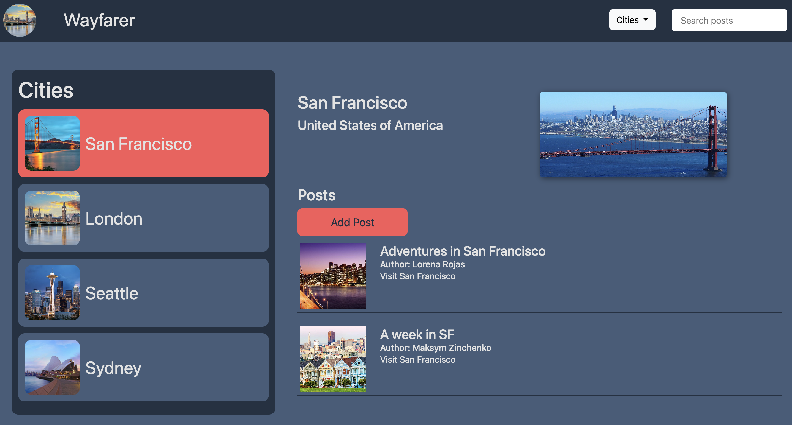
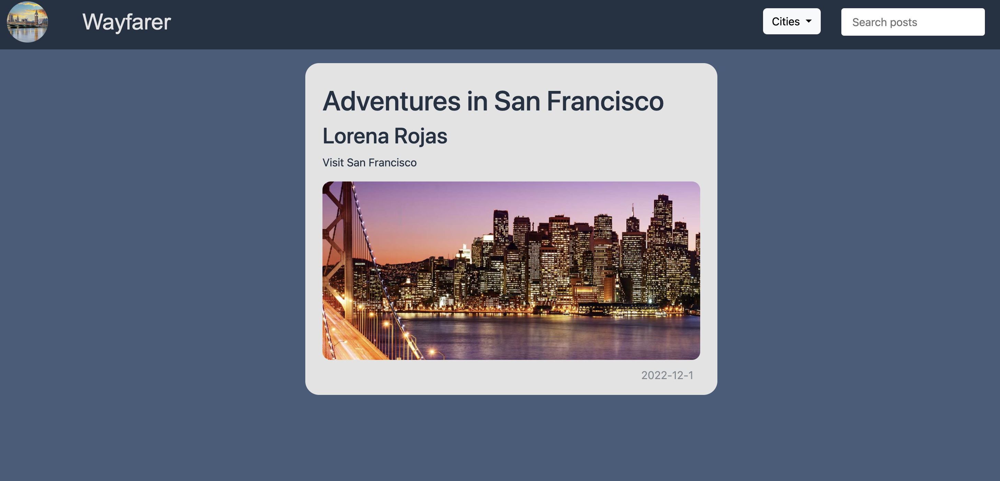
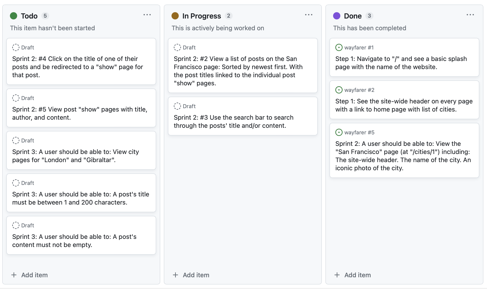

# Wayfarer

## Table of Contents
[Overview](#overview)  
[Tools and Technologies](#tools-and-technologies)  
[User Stories](#user-stories)  
[Routes](#routes)
[Planning Documentation](#planning-documentation)  
[CLI Commands](#cli-commands)  
[Dependencies](#dependencies)  
[Resources](#resources)

## Overview
A front-end application that allows users to share city reviews.

## Tools and Technologies
* Angular
* VSCode - IDE
* Ng Bootstrap 

## User Stories
* User should be able to view the homepage with carousel of cities.
* User should be able to see city pages.
* User should be able to choose city to see posts related to the city.
* User should be able to create a new post in any city page.
* User should be able to search for a post by the title of the post.
* User should be able to open post page and view title, author, photo and date published. 

## Routes
* Main page  
http://localhost:4200/
* Cities page  
http://localhost:4200/cities/{cityId}
* Post page  
http://localhost:4200/cities/{cityId}/post/{id}

## Planning Documentation

## CLI commands
`ng serve` - to run dev server, on `http://localhost:4200/`.

`ng build` - to build the project. The build artifacts will be stored in the `dist/` directory.

## Dependencies
* @angular/animations  
* @angular/common  
* @angular/compiler  
* @angular/core  
* @angular/forms  
* @angular/platform-browser  
* @angular/platform-browser-dynamic  
* @angular/router  
* @ng-bootstrap/ng-bootstrap  
* @popperjs/core  
* bootstrap  
* rxjs  
* tslib  
* zone.js  

## Resources
* [Google Images](www.google.com/images)
* [Ng Bootstrap](https://ng-bootstrap.github.io)
* [Stack Overflow](https://stackoverflow.com)
* [SheCodes](https://palettes.shecodes.io)
